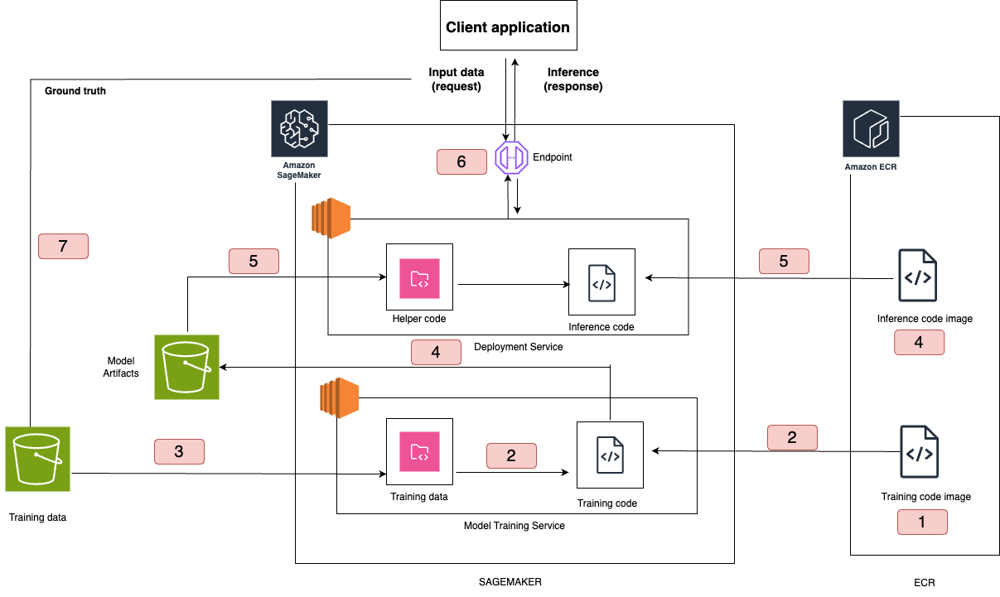

# MLOPS_CONCEPTS

## Sagemaker Architecture




## XGBoost Model Training and Deployment

XGBoost is an optimized distributed gradient boosting library designed for efficient and scalable training of machine learning models. It is an ensemble learning method that combines the predictions of multiple weak models to produce a stronger prediction. XGBoost is widely used for its ability to handle large datasets effectively.

## Features

- **Optimized Gradient Boosting**: Efficient implementation of gradient boosting algorithms.
- **Scalable**: Supports distributed computing for training on large datasets.
- **Flexible**: Can handle regression, classification, and ranking problems.
- **Customizable**: Offers a wide range of hyperparameters for model tuning.

## Installation

To install XGBoost, use the following command:

```bash
pip install xgboost

